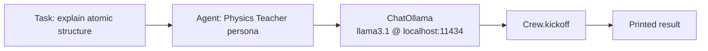

# AI-Agent-Simple-Prompt

Minimal CrewAI example: a single locally-run LLM agent answers one hardcoded prompt. The smallest possible "agent" demo — one agent, one task, one crew.

## How it works

`Hydrogen.py` configures a CrewAI `Agent` (a "Physics teacher" persona) backed by a local Ollama model (`llama3.1`), gives it a single `Task` ("teach me the atomic structure of Helium"), wraps both in a sequential `Crew`, and kicks it off. The agent's response is printed to stdout. `fooocus_colab.ipynb` is an unrelated Colab notebook for running Fooocus (a Stable Diffusion UI) and isn't part of this agent flow.



## Architecture

| File | Role |
|---|---|
| `Hydrogen.py` | Defines the agent, task, and crew; runs the single-prompt demo |
| `fooocus_colab.ipynb` | Standalone Colab notebook for Fooocus image generation (unrelated experiment) |

## Tech stack

CrewAI · LangChain (`langchain_ollama`) · Ollama (local LLM)

## Setup

```bash
pip install crewai langchain_ollama
ollama pull llama3.1
ollama serve
python Hydrogen.py
```
